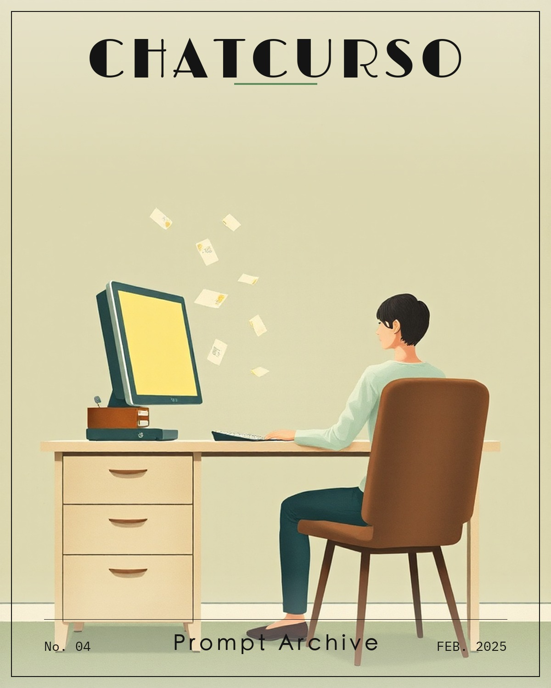
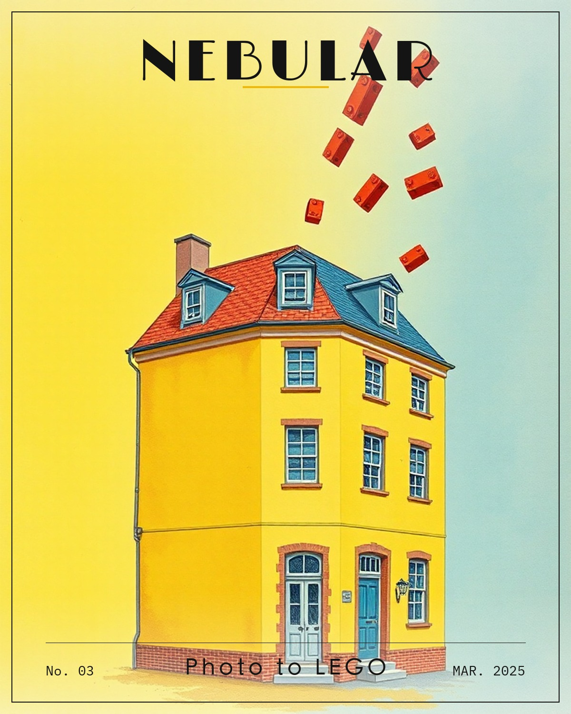
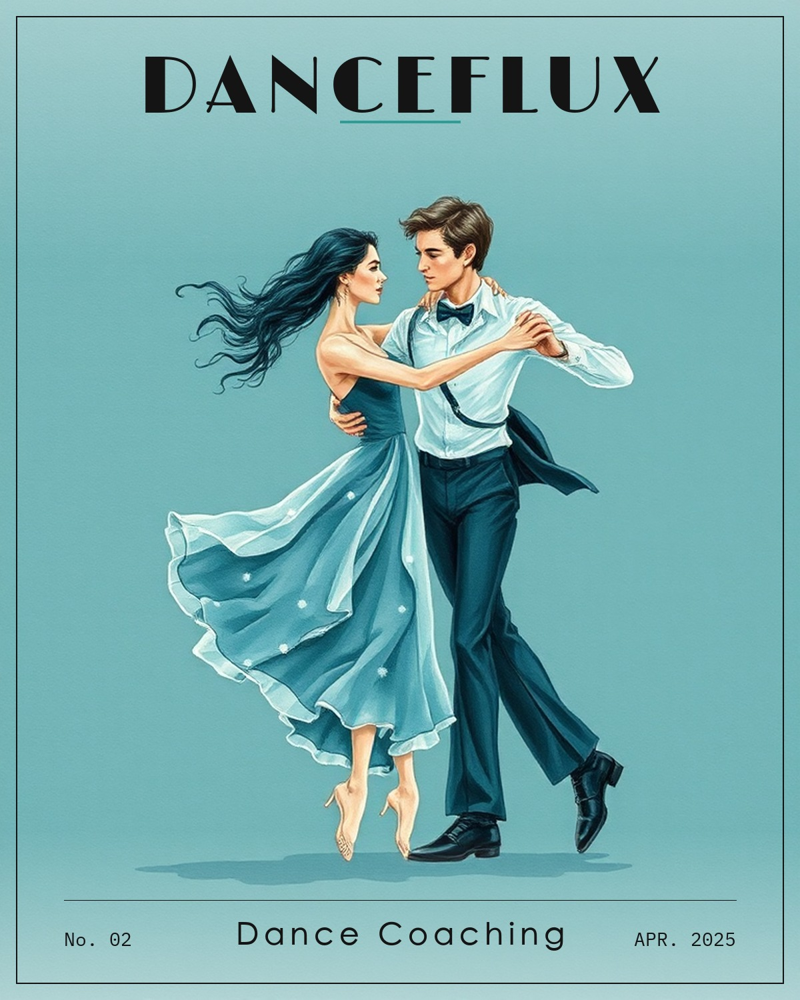
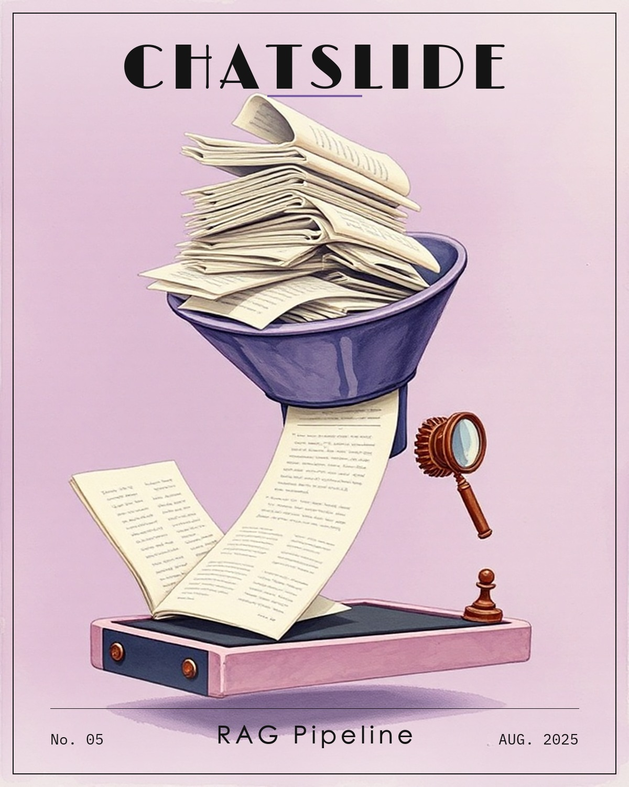
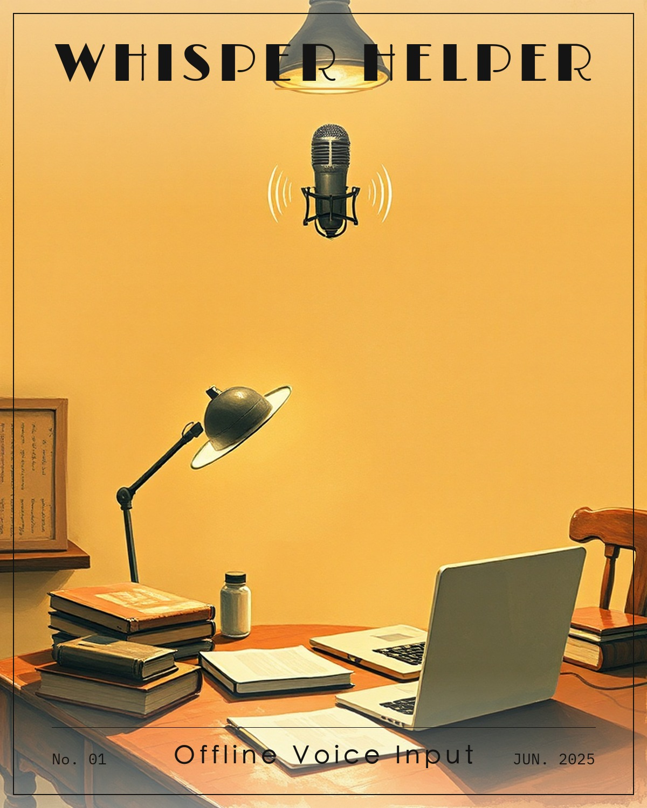
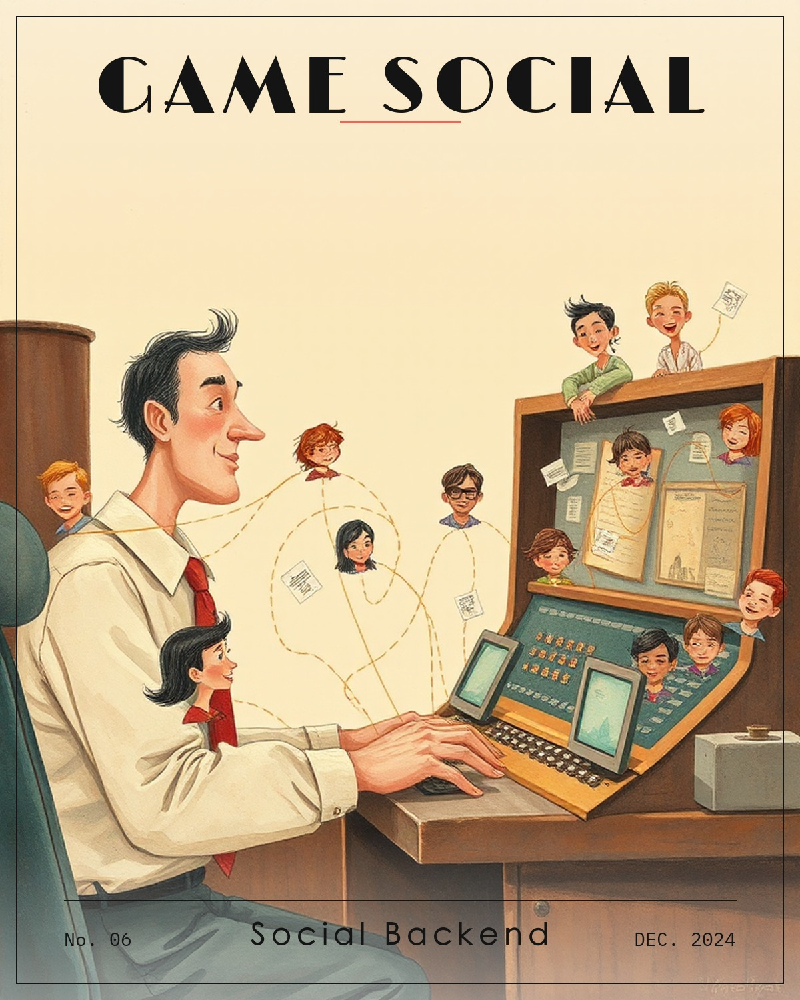

<h1 align="center">Lila Zhang — Portfolio</h1>

<p align="center"><em>A portfolio you read like a storybook. Turn the pages.</em></p>

<p align="center">
  
  
  
  
  
  
</p>

<p align="center">
  <strong>Live → https://lila-portfolio.vercel.app</strong>
</p>

---

Hi, I'm Lila — a software engineer and a maker studying Math + Computer Science at
UIUC, currently building at Dexmate. This site is my portfolio built as a little
book: it opens on a parchment page in the daylight, and you can turn it into a
Little Prince night sky. You flip through it page by page.

## The book

- **Chapter I — Prologue** · who I am, a headshot torn onto the page, and the tools I work with.
- **Chapter II — The Archive** · a 3D shelf of "magazine issues," one painted cover per project. Hover to browse, click to open an issue.
- **Chapter III — More Me** · the off-the-clock stuff — piano, dance, and the sports I keep coming back to.

Every cover in the Archive was painted **locally** with FLUX.1-schnell (offline, on
my own machine) — no stock art, no external image API.

## Featured work

| Issue | Project | What it is |
| --- | --- | --- |
| I | [Chatcurso](https://github.com/XinyunZhang5/Chatcurso) | A Chrome extension that quietly files every ChatGPT prompt into a searchable side panel. Fully local. |
| II | [Nebular](https://github.com/XinyunZhang5/nebular-design) | Turn a photo of a building into buildable LEGO with step-by-step instructions. |
| III | [Reframe](https://github.com/XinyunZhang5/danceflux) | Compare your dance take against a reference and get plain-language coaching. On-device pose estimation. |
| IV | [ChatSlide](https://chatslide.ai) | A RAG pipeline at ChatSlide.ai — structure-aware chunking lifted top-3 retrieval 62% → 81%. |
| V | [Whisper Helper](https://github.com/XinyunZhang5/whisper-helper) | A free, fully offline voice-input companion for macOS, powered by Whisper.cpp. |
| VI | Game Social | Backend for a gaming social platform — fanout-on-write feeds and sub-200ms WebSocket chat. |

## Built with

- **Next.js 16** (App Router, RSC) · **React 19** · **TypeScript**
- **Tailwind CSS** · **Framer Motion**
- The book's page-turn is a custom, `requestAnimationFrame`-driven horizontal page
  flip (imperative `clip-path`), not a library.
- Dual theming via CSS variables: **day** (parchment) and **night** (a star field).
- Cover and vignette illustrations generated locally with **FLUX.1-schnell**.

## Run it locally

```bash
npm install
npm run dev
# open http://localhost:3000
```

Build for production with `npm run build`.

## Notes

- Illustrations are my own, painted locally. Fonts: Limelight (display) and IBM Plex Mono.
- The initial scaffold was based on an MIT-licensed starter; that license is retained
  in [`LICENSE`](./LICENSE). Everything you see here — the book, the chapters, the art,
  the copy — is my own.

<p align="center"><sub>Made by Xinyun (Lila) Zhang · <a href="https://www.linkedin.com/in/xinyun-lila-zhang/">LinkedIn</a> · lilazh2026@gmail.com</sub></p>
